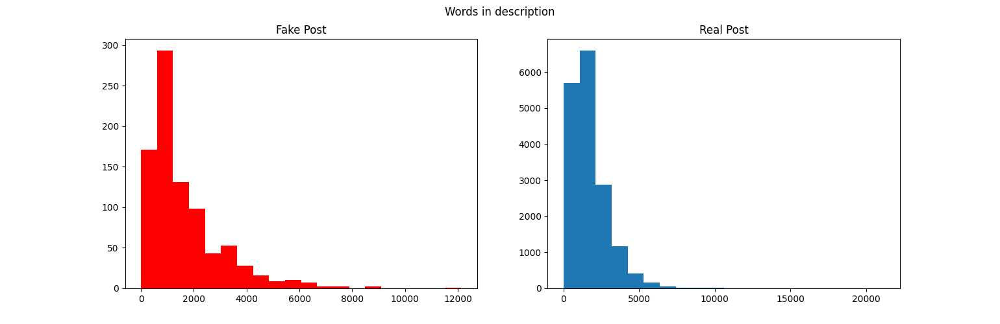

# Introduction:
Today it is quite difficult to find a job, and a student or just a person looking for a job will look for jobs online in various job ads or posts, 
and most people will not notice if the job is fake or real. 
If the job is real then it is excellent, but if the job is fake, it can either lead to a phishing site or it will cause sensitive information to be displayed.<br/>

With the help of advanced natural language processing, it is possible to build a classifier that will identify between fake and real jobs.

# Data:
Using the data from the site: https://www.kaggle.com/shivamb/real-or-fake-fake-jobposting-prediction <br/>
The data set contains about 18,000 job descriptions, of which about 800 are fake jobs. Using this data set, it is possible to create models that will learn and classify the fake jobs and the real ones. <br/>

All the fake jobs will be tagged as 1 and all the real jobs will be tagged as 0, under the ```'fraudulent'``` column, all information under the other columns will be the features. <br/>

### The following is a list of columns from the data set:                                                   
```
['job_id', 'title', 'location', 'department', 'salary_range'
'company_profile', 'description', 'requirements', 'benefits',
'telecommuting', 'has_company_logo', 'has_questions', 'employment_type',
'required_experience', 'required_education', 'industry', 'function','fraudulent']
```

# Data cleanning:
### The cleaning process included:
* Replacing places where NaN's is written, to a number. <br/>
* Delete duplicate rows. <br/>
* Deleting columns where the data is relatively identical between the data of the fake jobs and the real jobs, so they will not help us so much. <br/>

### Some conclusions about the data set:
* The 'function' and 'department' columns are identical, so we will remove one of them. <br/>
* Fake job postings were mainly aimed at full-time positions, whose requirements were very minimal. <br/>
* The telecommuting column has the same percentages as the number of real and fake jobs, So this column will not help us either.<br/>
* After creating a word cloud, it was found that the work publications had similar content, but the originals were more job specific. <br/>


# Frequency of Words for Geniune / Fake applications:




## Distribution over countries 


# WordCloud

Using WordCloud we can see a visual representation for the distribution of words. <br/>
### Genuine Cloud

### Fraud Cloud


# Imbalanced Data
We have noticed our data is WAY off-balance, as we can see in the following figure: <br/>


* We have used Random OverSampler to solve this issue.

# Results

Overall results are quite impressive. Un-balanced data has caused alot of issues and overfit problems. <br/>
Using 'TF-idf' Vectorizer to analyze our text and feed it to our models.

### Comparisons
* Overall scores <br/>


* Individual Training Scores <br/>


